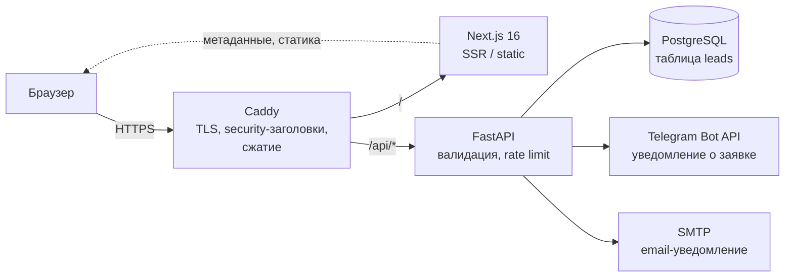

# Целевая архитектура — SimanDev

Дата: 2026-07-21. Основано на `docs/V0_AUDIT.md` и правилах проекта (`.cursor/rules/`).

Состав системы: лендинг на Next.js 16 (код из v0, после рефакторинга по аудиту) + бэкенд FastAPI (приём заявок → уведомления в Telegram и на email) + PostgreSQL. Деплой — Docker Compose на VPS за reverse proxy Caddy (TLS).

---

## 1. Общая схема



Caddy — единственная точка входа (80/443). Next.js и FastAPI наружу не торчат, живут в docker-сети. Маршрутизация по префиксу: `/api/*` → FastAPI, всё остальное → Next.js.

---

## 2. Целевая структура репозитория (monorepo)

```
siman-dev/
├── frontend/                  # Next.js-приложение (перенести текущий код)
│   ├── app/                   # layout, page, privacy/, robots.ts, sitemap.ts, icon.svg
│   ├── components/            # sections/, site/, ui/
│   ├── lib/                   # content.ts, schemas.ts (zod-контракт), utils.ts
│   ├── public/
│   ├── next.config.ts         # rewrites /api/* → FastAPI (только для local dev)
│   ├── package.json           # pnpm
│   └── Dockerfile
├── backend/
│   ├── app/
│   │   ├── main.py            # фабрика приложения, middleware, подключение роутеров
│   │   ├── api/
│   │   │   ├── leads.py       # POST /api/leads
│   │   │   └── health.py      # GET /api/health
│   │   ├── core/
│   │   │   ├── config.py      # pydantic-settings, все env в одном месте
│   │   │   ├── security.py    # хэширование user-agent, honeypot-проверка
│   │   │   └── ratelimit.py   # slowapi / in-memory лимитер
│   │   ├── models/            # SQLAlchemy 2.0 (lead.py)
│   │   ├── schemas/           # Pydantic v2 (lead.py, problem.py — RFC 9457)
│   │   ├── services/          # notifications.py (Telegram, SMTP), leads.py (бизнес-логика)
│   │   └── db.py              # async engine, session, Depends-фабрика
│   ├── alembic/               # миграции
│   ├── tests/                 # pytest + httpx.AsyncClient
│   ├── pyproject.toml         # uv
│   └── Dockerfile
├── deploy/
│   ├── docker-compose.yml         # база: postgres, backend, frontend, caddy
│   ├── docker-compose.dev.yml     # override: hot reload, порты наружу
│   ├── Caddyfile
│   └── deploy.sh                  # pull → build → migrate → up
├── docs/                      # V0_AUDIT.md, ARCHITECTURE.md, ADR-заметки
├── .cursor/rules/
├── .env.example
└── .gitignore
```

Принцип: фронтенд и бэкенд — независимые приложения со своими менеджерами пакетов (pnpm / uv) и Dockerfile; общее — только контракт API (раздел 3) и `deploy/`.

---

## 3. Контракт API

Соглашение между шагом «бэкенд» и шагом «интеграция фронта» — менять только синхронно с обеих сторон. Источник истины на фронте — zod-схема в `frontend/lib/schemas.ts`, на бэке — Pydantic-схема в `backend/app/schemas/lead.py`; они обязаны совпадать.

### POST /api/leads

Запрос (`application/json`):

| Поле | Тип | Ограничения |
|---|---|---|
| `name` | string | 1..100 символов, после trim не пустое |
| `phone` | string | телефон РФ в E.164: `+7XXXXXXXXXX` (11 цифр). Маску `+7 (999) 999-99-99` фронт нормализует **перед отправкой** |
| `message` | string? | 0..1000 символов, опционально |
| `consent` | boolean | строго `true` (согласие на обработку ПДн) |
| `honeypot` | string? | должен быть пустым или отсутствовать; непустое значение → тихий отказ |

Ответы:

- `201 Created` — `{ "id": "<uuid>", "status": "accepted" }`
- `422 Unprocessable Entity` — ошибка валидации, формат RFC 9457:
  `{ "type": "urn:simandev:validation-error", "title": "Validation failed", "status": 422, "errors": [{ "field": "phone", "message": "..." }] }`
- `429 Too Many Requests` — превышен rate limit (5 заявок / 10 мин с одного IP), RFC 9457 + заголовок `Retry-After`
- Заявка с непустым honeypot: отвечаем `201` с фиктивным id (боту незачем знать, что его поймали), в БД не пишем, уведомления не шлём.

### GET /api/health

`200 OK` — `{ "status": "ok" }`. Проверяет доступность процесса и соединение с БД; используется healthcheck'ом Docker и мониторингом.

Других интеграций на текущем этапе нет (Метрика — чисто клиентский скрипт, ей API не нужен). Если появится админка — добавим `/api/admin/*` отдельным роутером с авторизацией.

---

## 4. Модель данных

Единственная таблица `leads` (SQLAlchemy 2.0, миграции Alembic):

| Колонка | Тип | Комментарий |
|---|---|---|
| `id` | UUID, PK | `uuid4`, генерируется приложением |
| `name` | varchar(100) | |
| `phone` | varchar(16) | E.164 |
| `message` | text, nullable | |
| `created_at` | timestamptz | `server_default=now()` |
| `source_page` | varchar(255), nullable | путь страницы, с которой отправлена форма |
| `status` | varchar(16) | enum-строка: `new` / `contacted` / `closed`; default `new` |
| `user_agent_hash` | varchar(64), nullable | SHA-256 от User-Agent — для грубой дедупликации спама |

Что **не** храним:

- **IP-адрес в открытом виде** — нигде не пишем в БД и не логируем. IP используется только как ключ rate limit в памяти процесса (позже — Redis, если появится несколько реплик) и живёт там не дольше окна лимита.
- Сырой User-Agent, cookies, referrer-цепочки — не храним; только хэш UA.
- Согласие фиксируем фактом записи (валидатор не пропустит `consent != true`); отдельную колонку не заводим.
- Срок хранения заявок ограничен: настройка `LEAD_RETENTION_DAYS` (env), периодическая очистка — SQL-скрипт в cron/systemd-timer на VPS (требование правила 30-security).

---

## 5. Потоки данных и режимы рендеринга

### Рендеринг

- `/` (лендинг) — **полностью статическая** страница (SSG при сборке). Весь контент лежит в `lib/content.ts`, серверных данных нет, поэтому ни SSR, ни ISR не нужны: `next build` выпекает HTML один раз, обновление контента = новый деплой. Это самый быстрый и дешёвый вариант для лендинга.
- `/privacy` — статическая.
- `robots.ts`, `sitemap.ts`, иконки — генерируются при сборке.
- ISR не используем, пока контент не станет внешним (CMS/БД). Если появится — включим `revalidate` точечно.

### Путь заявки

```
Форма (react-hook-form + zod) → нормализация телефона в E.164
  → POST /api/leads
     • production/staging: Caddy маршрутизирует /api/* прямо в FastAPI
     • local dev без docker: rewrite /api/* → http://localhost:8000 в next.config.ts
  → FastAPI: honeypot → rate limit → Pydantic-валидация → INSERT в PostgreSQL
  → services/notifications: Telegram (обязательно) + email (если настроен SMTP);
    ошибки уведомлений логируются, но не валят запрос — заявка уже в БД
  → 201 → форма показывает экран «Спасибо!»
```

### Решение: форма шлёт запрос напрямую в FastAPI, без прослойки route handler

Принято: **`/api/*` минует Next.js**. В production маршрутизирует Caddy (rewrite в `next.config.ts` там даже не участвует), в локальной разработке без Docker — rewrite ведёт на `localhost:8000`.

Обоснование:

- Next.js route handler в цепочке дал бы вторую валидацию, второй hop и второе место для ошибок — при нулевой пользе: авторизации на фронте нет, скрывать URL бэкенда незачем (same-origin).
- Same-origin запросы (`simandev.ru/api/...`) избавляют от CORS в проде вообще; CORS-настройка нужна только для локальной разработки фронта против удалённого бэка.
- FastAPI и так делает всё, что делал бы handler: валидация, rate limit, уведомления.

Временное исключение: пока бэкенда нет, живёт заглушка `app/api/lead/route.ts` из плана P0 аудита. При появлении FastAPI она удаляется, а форма переводится на `POST /api/leads` (обратите внимание: путь меняется с `/api/lead` на `/api/leads`).

---

## 6. Окружения

Порядок продвижения: **local → staging (VPS разработчика) → production (сервер заказчика)**.

| | local | staging | production |
|---|---|---|---|
| Запуск | `docker compose -f docker-compose.yml -f docker-compose.dev.yml up` + hot reload (`next dev`, `uvicorn --reload`, bind-mount кода) | `deploy.sh` на VPS | `deploy.sh` на сервере заказчика |
| Домен | `http://localhost` (Caddy) или `localhost:3000` + `localhost:8000` без Caddy | `https://staging.simandev.ru` | `https://simandev.ru` |
| TLS | нет (или локальный self-signed Caddy) | Let's Encrypt (Caddy автоматически) | Let's Encrypt (Caddy автоматически) |
| `ENVIRONMENT` | `local` | `staging` | `production` |
| `DATABASE_URL` | compose-postgres, dev-пароль | compose-postgres, секрет на VPS | compose-postgres, секрет заказчика |
| `CORS_ORIGINS` | `http://localhost:3000` | `https://staging.simandev.ru` | `https://simandev.ru` |
| `NEXT_PUBLIC_SITE_URL` | `http://localhost:3000` | `https://staging.simandev.ru` | `https://simandev.ru` |
| Аналитика (`NEXT_PUBLIC_METRIKA_ID`) | пусто → скрипт не подключается | пусто → выключена | задан → включена |
| Уведомления Telegram | тестовый бот/чат | тестовый бот/чат | боевой бот → чат заказчика |
| SMTP | не настроен (лог вместо письма) | опционально | боевой |
| `robots.txt` | — | `Disallow: /` (staging не индексируем) | `Allow` |
| Docs FastAPI (`/docs`) | включены | включены | **выключены** |

Каждое окружение — свой `.env` рядом с `docker-compose.yml` (не в git). Staging и production идентичны по составу контейнеров — различия только в env.

---

## 7. Конфигурация (env-переменные)

Все настройки — через переменные окружения; состав зафиксирован в `.env.example`. Потребители:

| Переменная | Потребитель | Назначение |
|---|---|---|
| `DATABASE_URL` | backend (`core/config.py`), alembic | `postgresql+asyncpg://...` |
| `SECRET_KEY` | backend | подпись/крипто-нужды (сессии админки в будущем) |
| `ADMIN_EMAIL` | backend | получатель email-уведомлений |
| `ADMIN_PASSWORD_HASH` | backend | Argon2-хэш для будущей админки (сейчас не используется) |
| `SMTP_HOST` / `SMTP_USER` / `SMTP_PASSWORD` | backend (`services/notifications.py`) | email-канал; если `SMTP_HOST` пуст — канал выключен |
| `TELEGRAM_BOT_TOKEN` / `TELEGRAM_CHAT_ID` | backend (`services/notifications.py`) | Telegram-канал уведомлений |
| `CORS_ORIGINS` | backend (middleware) | список origin через запятую; `*` запрещён в проде |
| `NEXT_PUBLIC_SITE_URL` | frontend (`layout.tsx` metadataBase, sitemap) | канонический URL |
| `NEXT_PUBLIC_METRIKA_ID` | frontend | Яндекс.Метрика; пусто = выключена |
| `ENVIRONMENT` *(добавить)* | backend, compose | `local` / `staging` / `production` |
| `LEAD_RETENTION_DAYS` *(добавить)* | backend, cron-очистка | срок хранения заявок (152-ФЗ) |
| `RATE_LIMIT_LEADS` *(добавить)* | backend | напр. `5/10minutes` |

`.env.example` дополнить тремя помеченными переменными. Правило: фронтенд видит **только** `NEXT_PUBLIC_*`; секреты живут исключительно на стороне backend/compose.

---

## 8. Решения и компромиссы (ADR, кратко)

### ADR-1. Отдельный FastAPI вместо только Next.js route handlers

- **Контекст**: заявки можно принимать и в route handler Next.js.
- **Решение**: выделенный FastAPI-бэкенд.
- **Почему**: (1) в перспективе — админка, статусы заявок, выгрузки: это уже «настоящий» бэкенд с ORM, миграциями и тестами, экосистема Python здесь сильнее; (2) стек зафиксирован в брифе и правилах проекта — заказ на компетенции FastAPI; (3) независимый деплой и масштабирование: фронт пересобирается из-за контента, бэкенд не трогаем; (4) pytest-культура тестирования API проще и зрелее, чем тестирование route handlers.
- **Цена**: второй сервис (контейнер, логи, healthcheck) и необходимость держать zod/Pydantic-схемы синхронными. Для смягчения — контракт зафиксирован в разделе 3 этого документа.

### ADR-2. PostgreSQL

- **Решение**: PostgreSQL 17 в Docker Compose.
- **Почему**: асинхронный стек (SQLAlchemy 2.0 async + asyncpg) — первоклассная поддержка; надёжные типы (uuid, timestamptz); тот же движок от local до production — никаких сюрпризов при миграции с SQLite; заказчик получает стандартную, всем знакомую БД. Объём данных (заявки лендинга) для Postgres тривиален — запас по росту бесплатный.
- **Цена**: чуть тяжелее SQLite в обслуживании (бэкапы). Решается `pg_dump` в cron внутри `deploy/`.

### ADR-3. Caddy как reverse proxy

- **Решение**: Caddy 2 вместо Nginx.
- **Почему**: автоматический выпуск и продление Let's Encrypt-сертификатов из коробки (у Nginx — отдельный certbot и его таймеры); конфиг для нашей топологии — ~15 строк Caddyfile против заметно большего у Nginx; HTTP/2 и HTTP/3, редирект 80→443 и сжатие по умолчанию. Security-заголовки (CSP, HSTS, X-Content-Type-Options, Referrer-Policy) задаются в одном блоке `header` — это требование правила 30-security закрывается на уровне proxy.
- **Цена**: у Nginx больше комьюнити-рецептов под экзотику. Нашей топологии (два upstream по префиксу) это не касается; если понадобится экзотика — конфиги изолированы в `deploy/`, замена не затрагивает приложения.

### ADR-4. Статическая генерация лендинга (без SSR/ISR)


- **Решение**: `/` и `/privacy` — SSG.
- **Почему**: контент в репозитории, меняется деплоем; SSG даёт минимальный TTFB, отсутствие нагрузки на Node в рантайме и простой кеш в Caddy.
- **Цена**: правка текста = пересборка фронта (~1 мин в `deploy.sh`). Для лендинга приемлемо; при переезде контента в CMS — включить ISR точечно.

---

## 9. Cookie consent & аналитика

### Реализовано

- Баннер cookie: `components/site/cookie-banner.tsx` + `ConsentProvider`.
- Выбор хранится в cookie `consent_prefs` (12 месяцев, `SameSite=Lax`, `Secure` на HTTPS).
- Категории: «Необходимые» (всегда) и «Аналитика» (opt-in).
- Яндекс.Метрика загружается через `MetrikaLoader` только после согласия на аналитику.
- `trackGoal('lead_submit')` проверяет согласие через `readConsentCookie()`.
- Страница `/cookies` — таблица используемых cookie.
- Ссылка «Настройки cookie» в футере повторно открывает баннер.

Переменные окружения:
- `NEXT_PUBLIC_METRIKA_ID` — ID счётчика (если пуст — аналитика отключена).
